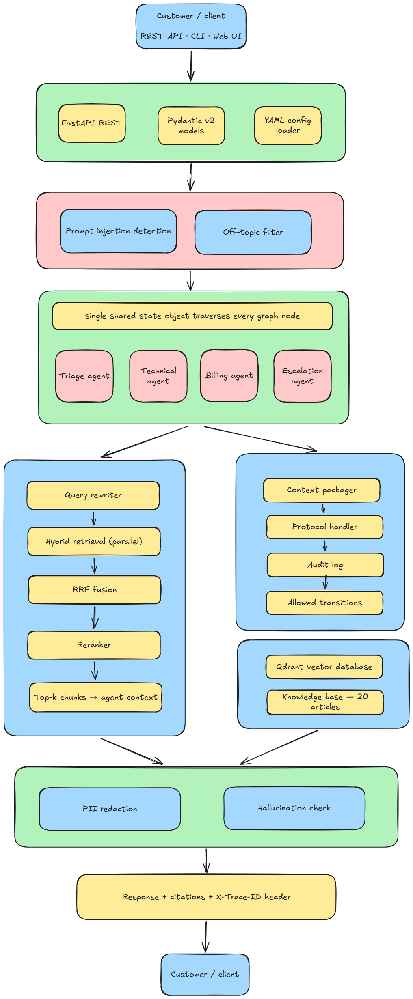

# CloudDash Multi-Agent Customer Support

Production-grade reference implementation for **CloudDash**, a fictional cloud infrastructure monitoring SaaS. The system routes customers through **triage, specialist agents, and guardrails**, with **hybrid RAG** (Qdrant + BM25), **LangGraph** orchestration, a documented **handover protocol**, **multi-intent routing**, and **multi-language support**.

> **Inference stack**: Chat/LLMs via **Groq** (`llama-3.3-70b-versatile` for agents, `llama-3.1-8b-instant` for guardrails), Embeddings via **NVIDIA NIM** (`nvidia/nv-embedqa-e5-v5`), Reranking via **NVIDIA NIM** (`nvidia/llama-3.2-nv-rerankqa-1b-v2`). No OpenAI key required.

---

## System Architecture & Flow



---

## Tech Stack

| Layer | Choice | Rationale |
|-------|--------|-----------|
| Orchestration | **LangGraph** | Explicit state machine, conditional routing, and auditable handovers vs opaque `AgentExecutor` loops. |
| LLMs (Agents & Guardrails) | **Groq** | Ultra-fast inference (`llama-3.3-70b-versatile` & `llama-3.1-8b-instant`) for real-time triage, classification, and agent execution. |
| Embeddings & Reranking | **NVIDIA NIM** | High-quality enterprise retrieval (`nv-embedqa-e5-v5` & `llama-3.2-nv-rerankqa-1b-v2`), accelerated via NVIDIA's cloud endpoints. |
| Vectors | **Qdrant** (`:memory:` in dev / URL in prod) | Fast local iteration; same client API targets a URL for staging/prod. |
| Hybrid search | **Dense + BM25 + RRF** | Lexical coverage for exact SKUs/errors; vectors for paraphrase; RRF merges ranks without brittle score calibration. |
| API | **FastAPI** | Async-friendly, OpenAPI docs, typed request/response models. |
| Models | **Pydantic v2** | Shared schemas between graph state, API, and persistence. |
| Logging | **structlog** (JSON) | Machine-parseable logs with trace/conversation correlation. |

---

## Setup

1. **Python 3.11+** recommended.

2. Install dependencies:

```bash
pip install -r requirements.txt
```

3. Environment (both `NVIDIA_API_KEY` and `GROQ_API_KEY` are required):

```bash
cp .env.example .env
# Required
NVIDIA_API_KEY=nvapi-...
GROQ_API_KEY=gsk_...

# Optional overrides
GROQ_CHAT_MODEL=llama-3.3-70b-versatile
NVIDIA_EMBEDDING_MODEL=nvidia/nv-embedqa-e5-v5
LLM_REQUEST_TIMEOUT_SEC=120
```

4. **Ingest the knowledge base** (embeddings + Qdrant upsert + BM25 pickle):

```bash
python -m knowledge_base.ingest
```

5. Run the API:

```bash
uvicorn api.main:app --reload
```

Open `http://127.0.0.1:8001/docs` for interactive OpenAPI, `http://127.0.0.1:8001/ui` for the chat UI.

### Optional: disable LangSmith tracing in CI

```bash
export LANGCHAIN_TRACING_V2=false
export LANGSMITH_TRACING=false
```

---

## API Endpoints

| Method | Path | Description |
|--------|------|-------------|
| POST | `/conversations` | Start a new conversation |
| POST | `/conversations/{id}/messages` | Append a message to an existing conversation |
| GET | `/conversations/{id}` | Retrieve full conversation state |
| GET | `/conversations/{id}/handovers` | List handover events for a conversation |
| GET | `/handovers` | List all handover events (global) |
| GET | `/health` | System health check (KB status, agent readiness) |
| POST | `/kb/reload` | Trigger async knowledge base re-ingestion |

All responses include an `X-Trace-ID` header for end-to-end request tracing. The same value appears in the JSON body as `trace_id`.

---

## API Examples (Assessment Scenarios)

Set `BASE=http://127.0.0.1:8001`. Responses include `X-Trace-ID`.

**1) Technical -- alerts after AWS credential update**

```bash
curl -s -X POST "$BASE/conversations" -H "Content-Type: application/json" \
  -d "{\"initial_message\": \"My CloudDash alerts stopped firing after I updated my AWS integration credentials yesterday. I am on the Pro plan.\", \"plan_type\": \"Pro\"}"
```

**2) Cross-agent -- SSO check THEN upgrade (multi-intent)**

```bash
curl -s -X POST "$BASE/conversations" -H "Content-Type: application/json" \
  -d "{\"initial_message\": \"I want to upgrade from Pro to Enterprise, but first can you check if the SSO integration issue I reported last week has been resolved?\", \"plan_type\": \"Pro\"}"
```

*Expected flow*: Triage -> Technical (SSO, `secondary_intents=[billing]`) -> Technical resolves -> handover -> Billing (Enterprise upgrade).

**3) Escalation -- double charge + manager**

```bash
curl -s -X POST "$BASE/conversations" -H "Content-Type: application/json" \
  -d "{\"initial_message\": \"I have been charged twice for April. I need an immediate refund and I want to speak to a manager.\"}"
```

**4) KB miss -- Datadog (graceful no-answer)**

```bash
curl -s -X POST "$BASE/conversations" -H "Content-Type: application/json" \
  -d "{\"initial_message\": \"Does CloudDash support integration with Datadog for cross-platform alerting?\"}"
```

**Continue a thread**

```bash
curl -s -X POST "$BASE/conversations/$CONV_ID/messages" -H "Content-Type: application/json" \
  -d "{\"conversation_id\": \"$CONV_ID\", \"message\": \"Any update?\"}"
```

**Health**

```bash
curl -s "$BASE/health"
```

---

## Guardrail System

The input guardrail (`guardrails/input_guard.py`) uses a four-layer architecture with no bypass paths. Every user message passes through all applicable layers in order:

| Layer | Mechanism | Purpose |
|-------|-----------|---------|
| 1 | Regex injection patterns (19 rules) | Blocks prompt injection, jailbreak attempts, and instruction override attacks. Case-insensitive. |
| 2 | Allow-keyword fast pass | If the message contains a known CloudDash support term (e.g. "alert", "billing", "SSO"), skip further off-topic checks. |
| 3 | Regex off-topic patterns | Hard blocks for clearly non-support queries (recipes, sports, homework). |
| 4 | LLM classification (Groq, few-shot) | Catches ambiguous off-topic messages that slip past regex. Includes few-shot examples for consistent classification. |

The output guardrail (`guardrails/output_guard.py`) applies PII redaction (credit cards, SSNs, emails) and hallucination checks against retrieved passages.

---

## Design Decisions and Trade-Offs

### Multi-intent routing
Triage classifies a **primary** intent and a `secondary_intents` list. Technical agent reads `secondary_intents` after resolving the primary issue and triggers a typed handover to Billing/Account automatically. A keyword fallback fires when state is constructed without triage (e.g. unit tests or direct agent invocation).

### Category-filtered retrieval with fallback
Each agent passes its `kb_categories` list directly to Qdrant as a `MatchAny` server-side filter. If the rewritten query returns zero results, the retriever automatically falls back to the original query. If results are still empty and a category filter was applied, it retries without the filter. This three-stage approach prevents false "no documentation" responses.

### Multi-language support
The triage agent detects the language of incoming messages and stores it in `entities.detected_language`. Downstream agents receive an instruction to respond in the customer's language while translating KB article content. This enables non-English customers to receive support without manual language routing.

### Retry / backoff
All LLM calls in `BaseAgent` are wrapped with `@with_retries(max_attempts=3, base_delay=1s, backoff_factor=2)`. Errors matching 429, 502, 503, 504, or timeout strings trigger automatic retry without surfacing a failure to the customer.

### Handover protocol
Cross-agent handovers are validated through `HandoverProtocol`, which defines allowed transitions (e.g. Technical <-> Billing, any -> Escalation). Every handover is logged to both an in-memory store and a persistent JSONL file at `logs/handovers.jsonl`, queryable via the `/handovers` API.

### Qdrant in-memory
Zero local infra; trade-off -- vectors are not durable across process restarts until `ingest.py` is re-run (or you switch `config/settings.yaml` to URL mode).

### Hybrid retrieval
Reduces missed keyword and missed semantic failures; cost is keeping BM25 pickle and vector index in sync via ingest.

---

## Known Limitations

- Conversation store in the API is **in-memory** (demo scope). A production deployment should use Postgres or Redis.
- BM25 category filter operates post-fusion (in-Python), while the vector branch applies a Qdrant-side `MatchAny` filter. Full consistency requires BM25 to be rebuilt per agent category set.
- Non-English language detection relies on the triage LLM's classification accuracy. No dedicated translation model is used.

---

## How to Add a New Agent

1. Add a block under `agents:` in `config/agents.yaml` (include `kb_categories`).
2. Create `agents/<name>_agent.py` subclassing `BaseAgent`.
3. Register nodes and edges in `agents/orchestrator.py` and extend `GraphState` if new fields are required.

---

## Tests

```bash
pytest                          # all scenario tests
pytest -v tests/test_scenarios.py
```

Scenario tests:

| # | Scenario | Covers |
|---|----------|--------|
| 1 | Single technical agent | Alerts, AWS credentials, KB citations |
| 2 | Cross-agent handover | Multi-intent SSO -> Enterprise upgrade |
| 3 | Escalation trigger | Double-charge + frustrated sentiment |
| 4 | KB miss graceful | Unknown integration, no hallucination |

Full QA suite (`tests/qa_full.py`) covers 18 tests across routing, guardrails, retrieval, handover, observability, and edge cases.

---

## Observability

- Every request is assigned a `trace_id` (UUID) propagated via the `X-Trace-ID` response header and the JSON body.
- All agent invocations, LLM calls, guardrail triggers, and handover events are logged as structured JSON via `structlog` with `trace_id` and `conversation_id` correlation.
- Handover events are persisted to `logs/handovers.jsonl` for audit and compliance.

---

## Project Structure

```
clouddash-support/
  agents/           Triage, Technical, Billing, Escalation agents + orchestrator
  api/              FastAPI entry point, routes, response models
  config/           YAML configuration (agents.yaml, settings.yaml)
  guardrails/       Input guard (4-layer) and output guard (PII + hallucination)
  handover/         Handover protocol, packaging, and JSONL audit log
  knowledge_base/   20 curated KB articles (JSON) + ingestion pipeline
  models/           Pydantic schemas shared across all modules
  retrieval/        Embedder, Qdrant store, hybrid retriever, reranker
  tests/            Scenario tests + full QA suite (18 tests)
  ui/               Browser-based chat interface
  utils/            Structured logging, trace context, OpenAI compatibility layer
  logs/             Runtime handover audit logs
```

See **ARCHITECTURE.md** for a deeper component walk-through.
